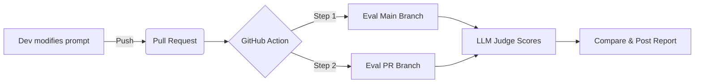
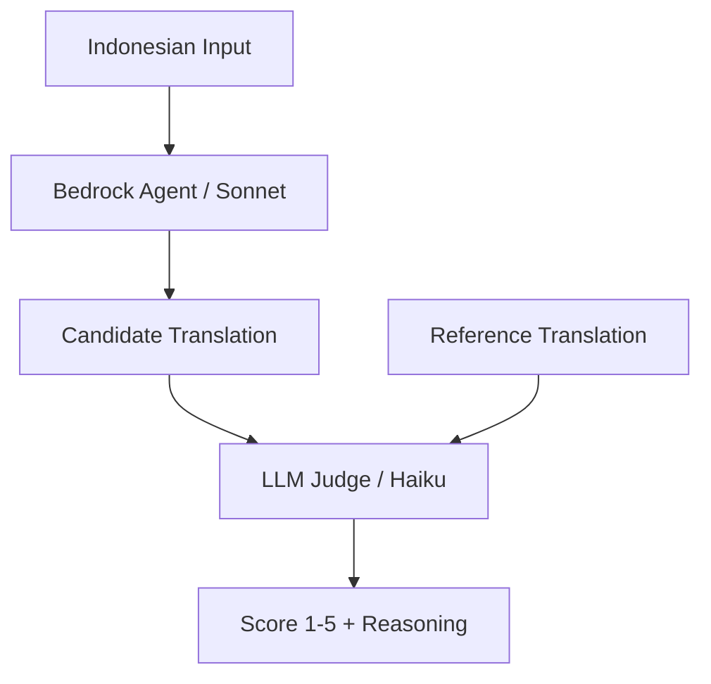

# 🌐 LingualLens: LLMOps for Translation Quality

> **Prompt Engineering as Code:** An automated CI/CD pipeline for AWS
> Bedrock Agents that treats AI Prompts like software code — with
> **LLM-as-a-Judge** evaluation.

 


## 📖 Overview

**LingualLens** is an intelligent Indonesian-to-English translation
agent built on **AWS Bedrock**. It translates Indonesian text into
natural English, classifies difficulty level, and provides linguistic
analysis.

Translation quality is evaluated using the **LLM-as-a-Judge** pattern:
a separate, smaller model (Claude 3 Haiku) independently scores each
translation on a 1–5 scale — replacing brittle string-matching with
semantic evaluation.

This repository demonstrates a mature **LLMOps workflow**:

1. **Prompts are Code**: The agent's instruction is version-controlled.
2. **LLM-as-a-Judge**: Translation quality scored by an independent LLM.
3. **Regression Testing**: Every PR triggers a baseline vs. candidate comparison.
4. **Live Reporting**: A bot posts a detailed Impact Report directly to the PR.

---

## 🤖 Features

- **Smart Translation**: Indonesian → English with natural, idiomatic phrasing.
- **Difficulty Classification**: SIMPLE, MODERATE, or COMPLEX.
- **Linguistic Analysis**: Explains translation decisions and challenges.
- **Cultural Notes**: Flags idioms, slang, and cultural context.
- **LLM-as-a-Judge Evaluation**:
  - Judge Model: Claude 3 Haiku (fast, cost-effective).
  - Translator Model: Claude 3 Sonnet (via Bedrock Agent).
  - Scores: 1–5 per translation with reasoning.
- **Dual-Dataset Evaluation**:
  - `validation.csv` — scored by judge against reference translations.
  - `inference.csv` — generative showcase of unseen inputs.

---

## 🛠️ Architecture & Workflow



### LLM-as-a-Judge Flow



### Impact Report

The bot comments on your PR with:

- **Scorecard**: Avg Judge Score, Quality %, Difficulty Accuracy.
- **Validation Table**: Side-by-side translations with judge scores.
- **Inference Showcase**: Live translations of unseen sentences.

---

## 📂 Project Structure

```
.
├── .github/workflows/
│   └── pipeline.yml          # CI/CD pipeline
├── data/
│   ├── validation.csv        # Labeled data (input + expected translation + difficulty)
│   └── inference.csv         # Unlabeled data (input only)
├── prompts/
│   └── instruction.txt       # Translator agent prompt (version-controlled)
├── scripts/
│   └── evaluate.py           # Evaluation script with LLM-as-a-Judge
└── README.md
```

---

## 🚀 Getting Started

### Prerequisites

- AWS account with Bedrock access.
- Claude 3 Sonnet & Claude 3 Haiku enabled.
- Bedrock Agent created.

### Setup GitHub Secrets

Add these secrets:

```
AWS_ACCESS_KEY_ID
AWS_SECRET_ACCESS_KEY
AWS_ROLE_ARN
AWS_REGION
AGENT_ID
```

---

## 🧪 How to Experiment

```bash
git checkout -b feature/improve-idiom-handling
```

Edit `prompts/instruction.txt`, push, and open a PR. The pipeline will:

1. Translate all validation inputs using the **main** branch prompt.
2. Translate all validation inputs using the **PR** branch prompt.
3. Score both sets using the **LLM Judge** (Haiku).
4. Post a comparison report to the PR.

---

## 📊 Dataset Format

**validation.csv**

```csv
input,expected_translation,expected_difficulty
"Aku lagi gabut nih","I'm so bored right now",SIMPLE
"Sudah jatuh tertimpa tangga","When it rains, it pours",MODERATE
```

**inference.csv**

```csv
input
"Jangan lupa bawa payung"
"Besar pasak daripada tiang"
```

---

## 🧑‍⚖️ LLM-as-a-Judge Scoring

| Score | Meaning |
|-------|---------|
| 5 | Perfect — meaning, tone, and fluency preserved |
| 4 | Good — minor stylistic differences |
| 3 | Acceptable — mostly correct, some nuance lost |
| 2 | Poor — significant errors or unnatural phrasing |
| 1 | Wrong — major errors or not a translation |

---

## 📝 License

Open-source. Free to use as LLMOps template.
